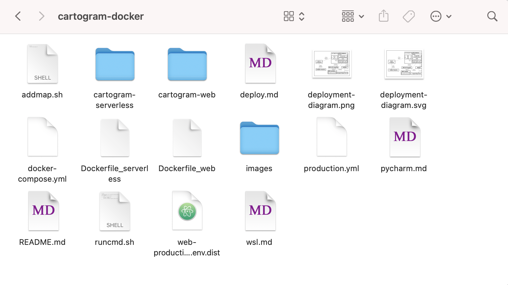
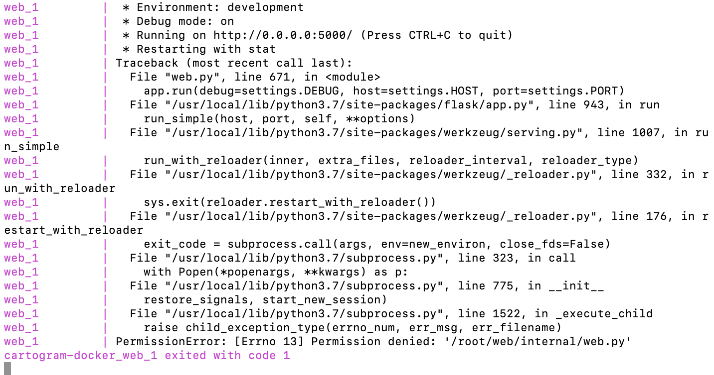
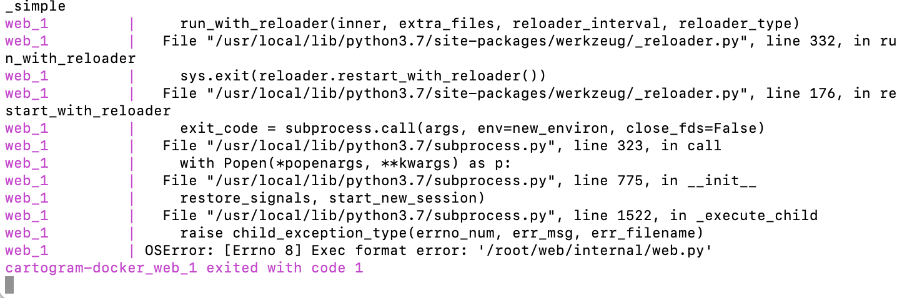
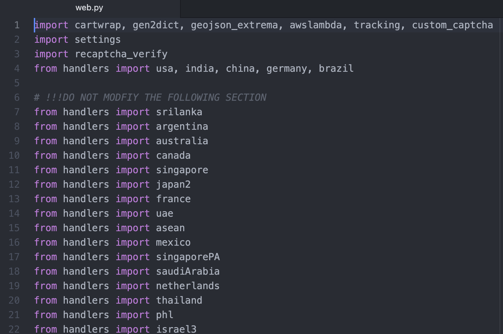
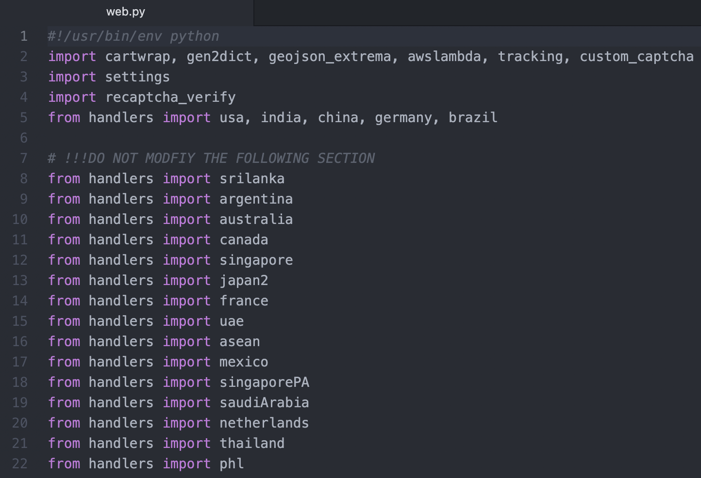
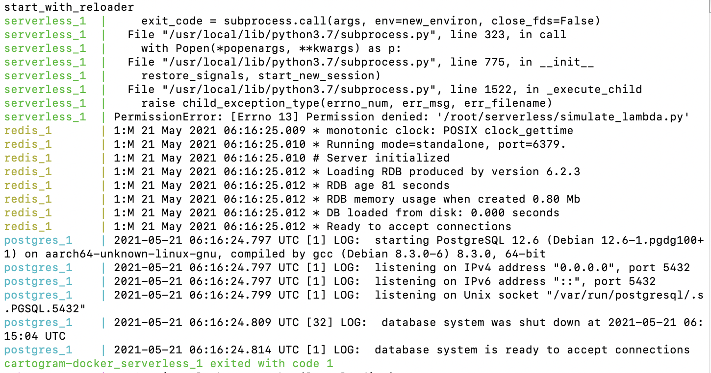

# Docker Application for Local Development of go-cart.io

The go-cart.io web application consists of two major parts:

1. The main, user-facing web application that users interact with to
   generate and view cartograms (`cartogram-web`), and

2. The AWS Lambda function that actually generates cartograms from user data
   using a small Python wrapper for the C code at 
   https://github.com/Flow-Based-Cartograms/go_cart (`cartogram-serverless`).
   
   For local development, a small wrapper using Python Flask
   is provided to simulate the HTTP API endpoint to the Lambda function on 
   the developer's local machine.

In addition, the main web application also uses PostgreSQL and Redis for data storage.

This repository contains a Docker compose file that makes it easy to install and
run all of the components necessary to develop the go-cart.io website locally
on your computer. This readme file contains instructions on how to go about this
on Ubuntu and macOS. If you are using Windows, please follow the instructions in `wsl.md` instead.

## Installing Docker

Before you begin, you must install Docker and Docker Compose.

### Ubuntu

First, you must install some dependencies for Docker and add the GPG keys for 
the Docker software repository:

```shell script
$ sudo apt-get update
$ sudo apt-get install \
    apt-transport-https \
    ca-certificates \
    curl \
    gnupg-agent \
    software-properties-common
$ curl -fsSL https://download.docker.com/linux/ubuntu/gpg | sudo apt-key add -
```

Verify that you now have the key with the fingerprint 
`9DC8 5822 9FC7 DD38 854A  E2D8 8D81 803C 0EBF CD88`, 
by searching for the last 8 characters of the fingerprint.

```shell script
$ sudo apt-key fingerprint 0EBFCD88
pub   rsa4096 2017-02-22 [SCEA]
      9DC8 5822 9FC7 DD38 854A  E2D8 8D81 803C 0EBF CD88
uid           [ unknown] Docker Release (CE deb) <docker@docker.com>
sub   rsa4096 2017-02-22 [S]

```

Now add the repository for Docker and install it:

```shell script
$ sudo add-apt-repository \
   "deb [arch=amd64] https://download.docker.com/linux/ubuntu \
   $(lsb_release -cs) \
   stable"
$ sudo apt-get update
$ sudo apt-get install docker-ce docker-ce-cli containerd.io
```

Then, add yourself to the `docker` group so you do not have to run Docker commands as root:

```shell script
$ sudo usermod -aG docker your-username
```

Finally, download and install Docker Compose as a separate binary:

```shell script
$ sudo curl -L "https://github.com/docker/compose/releases/download/1.25.5/docker-compose-$(uname -s)-$(uname -m)" -o /usr/local/bin/docker-compose
$ sudo chmod +x /usr/local/bin/docker-compose
```

### macOS

Install both Docker and Docker Compose by installing Docker Desktop for Mac according
to the instructions at https://docs.docker.com/docker-for-mac/install/.

## Installing `cartogram-web` and `cartogram-serverless`

The code for the go-cart.io web application is contained within two GitHub repositories: 
[cartogram-web](https://github.com/jansky/cartogram-web) and 
[cartogram-serverless](https://github.com/jansky/cartogram-serverless). Before you continue,
fork these two repositories so you have your own version of them. Note the URL that you will need
to use to clone both repositories.

Now, clone your forked `cartogram-web` and `cartogram-serverless` into the root directory
of *this* repository (i.e., the folder containing this readme — `cartogram_docker` folder). If you have SSH enabled for your GitHub account, this should look like:

```shell script
$ git clone git@github.com:your-github-username/cartogram-web.git
$ git clone git@github.com:your-github-username/cartogram-serverless.git
``` 
If not, you can try:
```shell script
$ git clone https://github.com/your-github-username/cartogram-docker.git
$ git clone https://github.com/your-github-username/cartogram-docker.git
``` 
After you are done, your `cartogram_docker` directory will look something like this:



## Starting the go-cart.io Web Application

To start the go-cart.io web application for local development and testing, first open the Docker application that you have downloaded earlier, and then run the following
command from the root directory of this repository (i.e., the folder containing this readme – `cartogram_docker` folder):

```shell script
$ docker-compose up
```

The first time you run this command it may take a while to download and install dependencies.

After all of the Docker containers have started up, all of their output will be collected
into the terminal window so you can see how the web application is responding to requests,
and if it encounters any errors. You can access the locally-running go-cart.io website at
http://localhost:5000. When you make changes to the code in either the
`cartogram-web` or `cartogram-serverless` repositories, their respective servers will reload 
automatically when you save your changes.

When you would like to shut down the go-cart.io web application, simply press Ctrl-C in the
terminal window you started Docker Compose in. After a few moments, the state of all the
Docker containers will be saved and the application will gracefully come to a halt.

**NOTE:** If you make a breaking change to the code (e.g., you introduce a syntax error), 
you will need to shut down the web application and start it again.

### macOS: Potential Errors while Executing `docker-compose up` Command and Fixes
On some macOS versions, after you the run the `docker-compose up` command, docker will fail to start  cartogram-docker_web and cartogram-docker_serverless because of permission and execution errors of web.py and simulate_lambda.py, respectively.

#### Making `cartogram-docker_web` Run by Fixing web.py Permission and Execution Errors
After running, `docker-compose up' command, you will see this:



To give permission, first nagvigate to the web.py parent folder which is .\cartogram-web\internal.

```shell script
$ cd cartogram-web
$ cd internal
```
Now, run this command to give permission for the web.py file.

```shell script
$ chmod u+rwx web.py
```
Running this command will allow the docker to use web.py file. Now, run:

 ```shell script
$ cd ..
$ cd ..
$ docker-compose up
```
Aforementioned commands might fix the issue and make the docker run `cartogram-docker_web`. However, you might see the following execution error:



To fix the execution error, open the web.py file via a text editor. After you open, you will something like this:



Add this line on top of the document:

 ```shell script
#!/usr/bin/env python
```


This will fix the execution error. Now run the `docker-compose up` command again.

```shell script
$ docker-compose up
```
Now the `cartogram-web` web server will run which you can access via http://localhost:5000 

#### Making `cartogram-docker_serverless` Run by Fixing simulate_lambda.py Permission and Execution Errors

However, you may have noticed the `cartogram-serverless' is not running and has exited with error code 1 due to the permission error of simulate_lambda.py



We follow the same process to fix the errors as we did for web.py

Fixing simulate_lambda.py permission error:
```shell script
$ cd cartogram-serverless
$ chmod u+rwx simulate_lambda.py
```
After fixing the permission error, if you run `docker-compose up`, now you will encounter the same execution error that we faced with web.py. You can fix it the same way. Open simulate_lambda.py via your text editor and add this line:

 ```shell script
#!/usr/bin/env python
```
This should fix the execution error.
