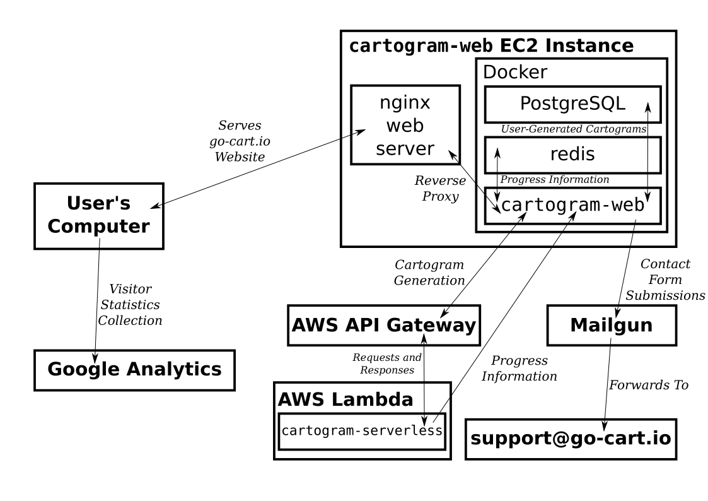

# Deployment of go-cart.io with Docker

The go-cart.io web application consists of several components which
must be deployed properly for the application to work for
end-users. After an initial setup, deployment of updated versions of
the application can be automated. In addition to presenting an overview of the
deployment architecture, this document provides step-by-step instructions for
performing the following tasks:

- [Initial Setup for `cartogram-serverless`](#initial-setup-for-cartogram-serverless)
- [Initial Setup for `cartogram-web`](#initial-setup-for-cartogram-web)
- [Updating `cartogram-serverless` and `cartogram-web`](#updating-cartogram-serverlessand-cartogram-web)

## Architecture Overview

The go-cart.io web application consists of two main components:
`cartogram-serverless` and `cartogram-web`.

The code in `cartogram-serverless` defines an AWS Lambda function that
generates cartograms from user data when invoked. The Lambda function
is made accessible to `cartogram-web` over HTTP via the AWS API
Gateway.  Because the API Gateway only supports sending a response
once all computation has finished, progress information is sent by
`cartogram-serverless` directly to `cartogram-web` via an HTTP
endpoint defined by `cartogram-web.`

The `cartogram-web` repository contains the code for the
[go-cart.io](https://go-cart.io) website that is accessed by
end-users. This interface is built around Python Flask, but also makes
use of two database servers. Redis is used to store information about
cartogram generation progress, and PostgreSQL is used to store
user-generated cartograms for the purpose of social media sharing.

To simplify deployment of the `cartogram-web` code and its
prerequisite code, we use Docker. Docker is an application that allows
you to run server applications in what is essentially a Linux virtual
machine called a _container_. Containers can be based upon _images_
that are seamlessly installed with Docker's built-in package
manager. For example, there is an image for PostgreSQL and Redis
database servers. In addition, `cartogram-web` has its own image
available for download on [Docker
Hub](https://hub.docker.com/repository/docker/janskyd/cartogram-web).

Since `cartogram-web` depends on several services, Docker Compose is
used to define the co-dependent containers as an _application_. Docker
Compose will start the containers in the correct order, and restart
them if they fail. The Docker Compose configuration for
`cartogram-web` is defined in the `cartogram-docker` repository.

To make the `cartogram-web` accessible to the outside world as
go-cart.io, we use an Amazon EC2 instance. Amazon EC2 provides virtual
computers in the cloud that can be used to run server software. In
this case, we run the `cartogram-web` Docker application and the nginx
web server. nginx is used as a public-facing web server that forwards
requests to the Python Flask server running in a Docker
container. This "reverse proxy" approach is used because nginx is more
secure and resilient than the Python Flask server, and because nginx
supports features (like serving websites over HTTPS) that the Flask
server does not.

In addition to communicating with the `cartogram-serverless` Lambda
function, `cartogram-web` relies on other ancillary services. Mailgun
is used to route submissions to the contact form to the go-cart
support email address. In addition, Google Analytics is also used to
collect statistics about site usage.

When changes are made to the master branch of `cartogram-serverless`,
`cartogram-web`, or `cartogram-docker`, they are automatically
deployed (i.e., made live) using GitHub Actions workflows. GitHub
Actions is a continuous integration / continuous deployment platform
that runs predefined _workflows_ when you make commits to a GitHub
repository (workflows are defined as YAML files in the
`.github/workflows` folder of your repository). GitHub Actions is free
for open-source projects.

For `cartogram-serverless` and `cartogram-docker`, pushing to the
master branch will trigger a workflow that connects to the Amazon EC2
instance over SSH and pulls the latest version of the application code
and restarts the Docker application. For `cartogram-web`, pushing to
the master branch will trigger a workflow that builds a Docker image
from the repository code, pushes that image to Docker Hub, and then
connects to the Amazon EC2 instance to pull the latest version of the
application code and restart the Docker application.

## Initial Setup for `cartogram-serverless`

The `cartogram-serverless` repository contains code for an AWS Lambda
function that computes cartograms from user data. In this section, you
will

1. Create a new Lambda function that will run the
   `cartogram-serverless` code, and
2. Make the Lambda function accessible over an HTTP API by creating an
   Amazon API Gateway endpoint trigger.

### Creating a New Lambda Function

Sign in to the AWS Console and navigate to the AWS Lambda home. Click
on the 'Create function' button.

Ensure that the 'Author from scratch' option is checked. Enter a
descriptive function name (e.g., `cartogram`), and select the 'Python
3.6' runtime. After you have selected these options, click the 'Create
function' button on the bottom-right.

Now you will upload the `cartogram-serverless` code to your
newly-created function. You will make use of the GitHub Actions
workflow for automated deployment and retarget it to your new
function. Navigate to the [repository secrets
page](https://github.com/jansky/cartogram-serverless/settings/secrets)
of the `cartogram-serverless` repository.

Click 'Update' for the `LAMBDA_FUNCTION_NAME` secret. Enter the name
of your new Lambda function in the 'Value' box, and click 'Update
secret'.

Then, click 'Update' for the `AWS_REGION` secret. Enter the name of
the AWS region the Lambda function is located in. If you are unsure,
take note of the URL when you access the AWS Console. It will look
something like:

	https://region.console.aws.amazon.com/console/...

So, if your AWS Console URL is:

	https://ap-southeast-1.console.aws.amazon.com/console/home

`ap-southeast-1` is your AWS region. When you have entered the region
correctly, click 'Update secret'.

To finish, you need to re-run an automated deployment run. Navigate to
the [Actions](https://github.com/jansky/cartogram-serverless/actions)
page of the `cartogram-serverless` repository. Click the top-most
commit under 'X Results'. Then, click 'Re-run jobs' on the top-right,
and select 'Re-run all jobs'. The job status will shortly turn yellow,
and after a minute or so it should turn green again, indicating that
your code has been pushed to your new Lambda function.

### Adding an Amazon API Gateway Trigger

Sign in to the AWS Console and navigate to the AWS Lambda home. Click
on the entry for your new function under 'Functions'.

Under 'Designer', click the 'Add trigger' button on the left. Select
'API Gateway' for the trigger type, and 'Create an API' under
'API'. For the API type, select 'REST API', and choose the 'API key'
security type. Finally, click 'Add' on the bottom-right.

After a few seconds, you should be redirected back to the Lambda
function overview page. Under the API Gateway trigger that appears at
the bottom of the page, click 'Details'. Note down the API endpoint
and API key - you will need these when you set up deployment of
`cartogram-web`.

## Initial Setup for `cartogram-web`

The `cartogram-web` repository contains code for running the
go-cart.io website interface. It should be deployed in an Amazon EC2
instance using the Docker configuration in the `cartogram-docker`
repository. In this section, you will

1. Create a new Amazon EC2 instance to host the go-cart.io website,
2. Install software dependencies on the EC2 instance,
3. Setup `cartogram-web` on the EC2 instance using Docker, and
4. Configure GitHub action workflows to automate deployment of new
   changes to `cartogram-web` and `cartogram-docker` to your EC2
   instance.
   
### Creating a new Amazon EC2 instance

Sign in  to the AWS  Console and navigate to  the EC2 home.  Under the
'Launch instance' section, click the 'Launch instance' button and select
'Launch instance' again.

First, you must select the EC2 instance image. Scroll down until you
reach 'Ubuntu Server 20.04 LTS (HVM), SSD Volume Type'. Ensure that
the '64-bit (x86)' option is checked, and click 'Select'. 

Now, select the 't2.micro' instance type, and click 'Review and Launch'
on the bottom-right. Then, on the review page, click 'Launch' on the
bottom-right.

In the dialog box that pops up, select 'Create a new key pair', and enter
a name (e.g., 'go-cart'). Then, click 'Download Key Pair'. You will be asked
to save a key file that will allow you to log on to your new EC2 instance
over SSH.

**Important note:** Keep this key in a safe place! If you lose it you will
not be able to log on to your EC2 instance!

After you download your key, navigate to the folder where you downloaded the
key file in a terminal window, and change the permissions as follows:

	$ chmod 600 go-cart.pem (or whatever your key file is)

The SSH client requires private key files to be accessible only to the user
they belong to. Setting the permission to 600 ensures this.

After you have set the key file permissions, go back to your browser
window and click 'Launch Instances' at the bottom-right. On the launch
confirmation page, click 'View Instances' at the bottom-right. You
should see that your new instance is starting up. Wait until the
instance state is listed as 'running' before proceeding to the next
section, and note the IPv4 Public IP assigned to the instance. You will
SSH to this address to access your new EC2 instance.

### Installing Software Dependencies on the EC2 Instance

In a terminal window, SSH into your new EC2 instance using the private
key file you downloaded ealier:

	$ ssh -i your-key-file.pem ubuntu@ip-address-of-ec2-instance

You may receive a warning about your SSH client being unable to
establish the authenticity of the new host upon first connection. You
should type 'yes' and press return to continue.

First, you will install the nginx web server and the certbot client
you will use to get an SSL certificate for the website:

	$ sudo apt update
	$ sudo apt install nginx certbot python3-certbot-nginx

Then, install Docker and Docker Compose:

	$ sudo apt install \
		apt-transport-https \
		ca-certificates \
		curl \
		gnupg-agent \
		software-properties-common
	$ curl -fsSL https://download.docker.com/linux/ubuntu/gpg | sudo apt-key add -
	
Verify that you now have the key with the fingerprint `9DC8 5822 9FC7
DD38 854A E2D8 8D81 803C 0EBF CD88`, by searching for the last 8
characters of the fingerprint.

	$ sudo apt-key fingerprint 0EBFCD88
	pub   rsa4096 2017-02-22 [SCEA]
		  9DC8 5822 9FC7 DD38 854A  E2D8 8D81 803C 0EBF CD88
	uid           [ unknown] Docker Release (CE deb) <docker@docker.com>
	sub   rsa4096 2017-02-22 [S]

Now finish installing Docker and Docker Compose:

	$ sudo add-apt-repository \
	  "deb [arch=amd64] https://download.docker.com/linux/ubuntu \
	  $(lsb_release -cs) \
	  stable"
	$ sudo apt update
	$ sudo apt install docker-ce docker-ce-cli containerd.io
	$ sudo curl -L "https://github.com/docker/compose/releases/download/1.25.5/docker-compose-$(uname -s)-$(uname -m)" -o /usr/local/bin/docker-compose
	$ sudo chmod +x /usr/local/bin/docker-compose
	
Finally, install the
[ghupdatesecret](https://github.com/jansky/ghupdatesecret/)
command-line utililty that you will use to configure the GitHub action
for automated deployment:

	$ sudo apt install python3-pip
	$ sudo pip3 install ghupdatesecret
	
### Setup `cartogram-web` on the EC2 Instance

Now that you have installed the required software dependencies, you
can now set up `cartogram-web` to run on your EC2 instance.

First, create a new user account to run the application code:

	$ sudo adduser cartogram --disabled-password

Press return at all the prompts for user information, and answer 'Y'
when prompted if the information you entered is correct. Then, add the
`cartogram` user to the `docker` group so it can run Docker commands:

	$ sudo usermod -aG docker cartogram

Now, sign on to this account and clone the `cartogram-docker`
repository:

	$ sudo su - cartogram
	$ git clone https://github.com/jansky/cartogram-docker.git

Now you need to configure environment variables for `cartogram-web`. First, copy the
environment variables template file:

	$ cd cartogram-docker
	$ cp web-production.env.dist web-production.env

Then, open `web-production.env` using `nano` (a simple command-line text
editor):

	$ nano web-production.env
	
Set the variables according to the instructions below:

#### SMTP Settings

Set the following variables to route contact form submissions through
Mailgun:

	CARTOGRAM_SMTP_HOST=smtp.mailgun.org
	CARTOGRAM_SMTP_PORT=587
	CARTOGRAM_SMTP_AUTHENTICATION_REQUIRED=TRUE
	CARTOGRAM_SMTP_USER=contactform@mg.go-cart.io
	CARTOGRAM_SMTP_FROM_EMAIL=contactform@mg.go-cart.io
	CARTOGRAM_SMTP_DESTINATION=support@go-cart.io

Now you need to reset the password to the `contactform` account. Sign
in to the [Mailgun
dashboard](https://app.mailgun.com/app/dashboard). Under 'Sending
domains', locate 'mg.go-cart.io', and click 'Domain settings' on the
right.

Select the 'SMTP credentials' tab, and click the 'Reset Password'
button for 'contactform@mg.go-cart.io'. Confirm you want to reset the
password in the modal that pops up, and copy the new password that
appears on the top-right. Now set the variable appropriately:

	CARTOGRAM_SMTP_PASSWORD=password you just copied

#### Lambda Function Settings

Set the following variables to use your new Lambda function for
cartogram generation:

	CARTOGRAM_LAMBDA_URL=API endpoint URL from the previous section
	CARTOGRAM_LAMBDA_KEY=API key from the previous section

Now you need to generate a secret key that the Lambda function will
use to authenticate itself to `cartogram-web` when sending cartogram
generation progress information. To do this, first press 'Ctrl-Z' to
force nano into the background. You should be greeted with the command
prompt after you do this. Then, run:
	
	$ head -c 35 /dev/urandom | base64 | tr -d /+=
	
Make note of the randomly generated string that appears. Run

	$ fg

to return to nano, and set the progress secret variable appropriately:

	CARTOGRAM_PROGRESS_SECRET=random string you just generated

At this point, you must also inform the Lambda function of your new
secret key. Sign in to the AWS Console and navigate to the AWS Lambda
home. Click on the entry for your Lambda function. Under 'Environment
Variables', click the 'Edit' button on the right.

Click 'Add environment variable'. Set the key to
`CARTOGRAM_PROGRESS_URL`, and the value to
`https://go-cart.io/setprogress`. Then, click 'Add environment
variable' again. Set the key to `CARTOGRAM_PROGRESS_SECRET`, and the
value to the secret key you just generated. Click the 'Save' button on
the bottom-right.

#### Google Analytics

To enable collection of site visitor statistics with Google Analytics,
you need to get the Google Analytics tracking ID for go-cart.io. Sign
in to the [Google Analytics dashboard](https://analytics.google.com),
and click the 'Admin' button on the bottom-left.

On the left-most column, ensure the 'go-cart production' account is
selected. Then, in the middle column, ensure the 'Go-Cart' property is
selected. Next, click 'Property Settings' in this middle column. In
the property settings page that opens up, copy the tracking ID (it
should begin with UA-).

Then, set the tracking ID variable appropriately:

	CARTOGRAM_GA_TRACKING_ID=tracking ID you just copied

You can leave all other variables unchanged. Save the file and exit
nano by pressing 'Ctrl-O', then return, and finally 'Ctrl-X'.

#### Docker Setup

Start the `cartogram-web` Docker application by running

	$ docker-compose -f production.yml up -d

`cartogram-web` and its required services are now running in the
background, and will restart as necessary.

#### nginx Setup

As of now, `cartogram-web` is running on `localhost:5000`. To make it
accessible to the outside world, you must configure nginx to act as a
reverse proxy.

Run

	$ exit

To get from the `cartogram` user back to the `ubuntu` user where you
can run commands as root using `sudo`. Then, open up the nginx
configuration using nano:

	$ sudo nano /etc/ngonx/sites-enabled/default

Find the line reading:

	server_name _;

and change it to:

	server_name go-cart.io;

Then, find the block reading:

	location / {
		
		try_files $uri $uri/ =404;
	}

and change it to:

	location / {
		
		proxy_pass http://127.0.0.1:5000;
	}

Press 'Ctrl-O', then return, and finally 'Ctrl-X' to save your changes. Then,
restart nginx with your new configuration:

	$ sudo systemctl restart nginx

#### Domain Name Setup

To continue with the setup, you will need to point the 'go-cart.io'
domain to the IP address of the EC2 instance. You should follow the
documentation provided by your domain name registrar to do this. They
should provide you with a page to edit the DNS records associated with
the go-cart.io domain. On this page, you should ensure that the A
record for the domain points to the IP address of your EC2 instance.

Note that when you save these changes it will take some time for the
new IP address to propogate throughout the Internet (usually 15-30
minutes).

#### EC2 Firewall Configuration

By default, AWS only allows incoming SSH-traffic to EC2 containers. To
allow users to access the go-cart.io website, you will need to allow
incoming HTTP and HTTPS traffic. To do this, sign in the AWS Console,
navigate to the EC2 home, and click 'Running instances' under the
'Resources' section at the top.

Select your EC2 instance by clicking anywhere on its row. Then, in the
'Description' tab that opens below, find the 'Security groups' label
in the right-hand column. Click on the name of the security group (it
will likely be something like 'launch-wizard-X', where X is some
number).

At the bottom, select the 'Inbound rules' tab, and click 'Edit inbound
rules' at the top-left of this section. Click 'Add rule'. Select the
'HTTP' rule type. Then, click 'Add rule' again and select the 'HTTPS'
rule type. Under 'Source', select 'Anywhere' for both rules. Finally,
click 'Save rules' on the bottom-right.

#### SSL Certificate

The final step is to obtain an SSL certificate so that the go-cart.io
website is accessible over HTTPS. To do this, run

	$ sudo certbot --nginx
	
on the EC2 instance. This will launch an interactive wizard that will
help you obtain an SSL certificate from LetsEncrypt and configure
nginx to use it.

First, enter the email address you want to receive certificate renewal
notifications on, and press return. Then, press 'A' and return to
agree to the terms of service, and press 'Y' or 'N' and return as you
wish, depending on whether you want to receive emails from the
Electronic Frontier Foundation.

Then, the wizard will search your nginx configuration to find a list
of domain names to obtain certificates for. It should find go-cart.io:

    Which names would you like to activate HTTPS for?
    - - - - - - - - - - - - - - - - - - - - - - - - - - - - - - - - - - - - - - - -
    1: go-cart.io
    - - - - - - - - - - - - - - - - - - - - - - - - - - - - - - - - - - - - - - - -
    Select the appropriate numbers separated by commas and/or spaces, or leave input
    blank to select all options shown (Enter 'c' to cancel):

Press '1' and then return to select go-cart.io. Wait a few moments
while LetsEncrypt verifies that you own the go-cart.io domain and
issues a certificate. Then, you should be greeted with the following prompt:

    Please choose whether or not to redirect HTTP traffic to HTTPS, removing HTTP access.
    - - - - - - - - - - - - - - - - - - - - - - - - - - - - - - - - - - - - - - - -
    1: No redirect - Make no further changes to the webserver configuration.
    2: Redirect - Make all requests redirect to secure HTTPS access. Choose this for
    new sites, or if you're confident your site works on HTTPS. You can undo this
    change by editing your web server's configuration.
    - - - - - - - - - - - - - - - - - - - - - - - - - - - - - - - - - - - - - - - -
    Select the appropriate number [1-2] then [enter] (press 'c' to cancel): 

Press '2' and return to enable redirecting all visitors to the HTTPS
version of the site.

Now, you will enable auto-renewal of this certificate using cron. Run

	$ sudo crontab -e

Press '1' and return to select nano as the editor. Once nano opens, add the
following line at the bottom of the file:

	17 2 * * * certbot renew

This will run the certificate renewal program every day at 02:17
(LetsEncrypt recommends running the renewal program once per day at an
"irregular" time to reduce demand concentration) to check if
certificate renewal is needed, and renew the certificate if
required. Press 'Ctrl-O', then return, and finally 'Ctrl-X' to save
and exit the cron configuration.

At this point, setup of `cartogram-web` is complete. If you navigate
to [go-cart.io](https://go-cart.io) in your browser, the site should
be up and running.

### Configuring GitHub Action Workflows for Automated Deployment

To configure automated deployment of changes to the `cartogram-web`
and `cartogram-docker` repositories, you must perform some additional
actions on your EC2 instance. First, log in to the `cartogram` user:

	$ sudo su - cartogram

Then, create the file `deploy.sh` in your home directory using nano:

	$ nano deploy.sh

Enter the following contents into the file:

	#!/bin/sh
	cd cartogram-docker
	git pull || exit 1
	docker-compose -f production.yml down
	docker-compose -f production.yml pull || exit 1
	docker-compose -f production.yml up || exit 1

Press 'Ctrl-O', return, and finally 'Ctrl-X' to save your
changes. Then, make the script executable:

	$ chmod +x deploy.sh

Each time you push to the master branch of `cartogram-web` and
`cartogram-docker`, a GitHub Action workflow will run that will
connect to your EC2 instance over SSH and run the `deploy.sh`
script. This script will pull the latest changes from
`cartogram-docker`, stop the running Docker application, pull the
latest Docker images, and relaunch the application with the updated
Docker images.

To finish, you need to generate an SSH key that will allow the GitHub Actions
workflows to connect to your EC2 instance over SSH. To do this, run

	$ ssh-keygen -f github

When prompted, press return twice to set an empty passphrase for the key.

Now, you need to create a GitHub personal access token so you can
upload your new SSH key to GitHub. Sign on to GitHub and navigate to
your account settings page. At the bottom, click 'Developer settings',
and then 'Personal access tokens'. Finally, click the 'Generate new
token' button at the top-left.

Give the new token a name (e.g., 'SSH Key Token'), and select the
entire 'repo' scope for the new token by checking the box next to
'repo' in bold. Then, scroll down and click 'Generate token'. Copy the
generated token to the clipboard. Open a new file called `.token` with nano:

	$ nano .token

Paste your token's contents to the nano window, and press 'Ctrl-O',
then return, and finally 'Ctrl-X' to save this file.

Now, use `ghupdatesecret` to push your SSH private key to GitHub:

	$ cat github | ghupdatesecret jansky/cartogram-web DEPLOY_SSH_KEY -u your_github_username -p `cat .token`
	$ cat github | ghupdatesecret jansky/cartogram-docker DEPLOY_SSH_KEY -u your_github_usernae -p `cat .token`

Now you can delete the `.token` file:

	$ rm .token

You should also delete the personal access token from GitHub. Navigate
to the Personal access tokens page and click 'Delete' next to the
token you just created.

Now, install the public key into your `authorized_keys` file and
ensure that this file has the proper permissions:

	$ cat github.pub >> ~/.ssh/authorized_keys
	$ chmod 600 ~/.ssh/authorized_keys

Finally, you can delete the SSH key files:

	$ rm github github.pub

## Updating `cartogram-serverless`and `cartogram-web`

In the initial setup for `cartogram-serverless` and `cartogram-web`
you also configured automated deployment. This means that any changes
you push to the master branch of these repositories (as well as
`cartogram-docker`) will be immediately deployed to the live website.

This means that you should only push to master _after_ you are
confident that your changes are working.

	
