# Setting Up PyCharm for Developing the go-cart.io Website

PyCharm is the recommended IDE to use while developing the go-cart.io website. You will need to use the Professional edition to take advantage of Docker integration that will allow for code completion and correct import error detection. This document will help you set up PyCharm for development of the go-cart.io website on your computer. It assumes that you have already set up the Docker application for the website. If you have not done so, please do this by following the guide in `README.md`.

## Installing PyCharm

To begin, you will need to install PyCharm Professional Edition. 

**Note:** If you are a student or educator at an accredited educational instutition, you can use the Professional Edition free of charge via a JetBrains Educational License. The easiest way to get this license is to first sign up for GitHub Education Benefits at https://education.github.com/discount_requests/new. Then, sign up for a JetBrains Educational License at https://www.jetbrains.com/shop/eform/students and simply sign in to your GitHub account to verify your student status.

### Mac and Linux 

Users of Linux and macOS should download the Professional Edition at https://www.jetbrains.com/pycharm/download and follow the installation instructions for your operating system.

### Windows

If you are using Windows, you should install the Linux version of PyCharm in the WSL. Graphical applications on Linux use the X Window System to draw their interfaces on screen. To run graphical Linux applications on the WSL, you must install an X Server on Windows, a desktop environment for the WSL, and configure WSL applications to use this X Server. We will first configure this, and then download and install PyCharm on the WSL.

#### Installing VcXsrv and XFCE

Follow the instructions at https://solarianprogrammer.com/2017/04/16/windows-susbsystem-for-linux-xfce-4/ to install the VcXsrv X Server for Windows and the XFCE desktop environment for the WSL.

If the Linux desktop appears blurry, you can perform the following steps to remedy this:

1. Open a WSL terminal and run

    ```shell script
    $ nano ~/.bashrc
    ```

    In the terminal editor interface that appears, use the down arrow key to navigate to the bottom of the file and insert the following lines:

    ```
    export GDK_SCALE=0.5
    export GDK_DPI_SCALE=2
    ```

    Press Ctrl-O, Return, and then Ctrl-X to save and exit.

2. Close all running instances of VcXsrv. In the Windows Explorer, navigate to `C:\Program Files\VcXsrv`. Right click on `vcxsrv.exe` and click on 'Properties'. In the window that appears, select the 'Compatility' tab. Click on 'Change high DPI settings'. In the window that appears, ensure 'Enable Override high DPI scaling' is checked, and select the 'Application' option. Click 'OK' twice to save these changes.

With VcXsrv and XFCE installed, you can access your WSL Linux desktop by first starting VcXsrv, and then running the command `xfce4-session` in a WSL bash terminal.

#### Downloading and Installing PyCharm

Start the XFCE Desktop if you haven't already. Open a new terminal window (there should be a dock at the bottom of the desktop with a terminal icon). Then, download and extract the latest edition of PyCharm:

```shell script
$ wget https://download.jetbrains.com/python/pycharm-professional-2020.1.1.tar.gz
$ tar xvf pycharm-professional-2020.1.1.tar.gz
$ rm pycharm-professional-2020.1.1.tar.gz
```

**Note:** If the `wget` command is not found, you can install it by running `sudo apt install wget`.

The PyCharm installation is now found in the `pycharm-2020.1.1` folder within your WSL home directory.

#### Running PyCharm

Start the XFCE Desktop if you haven't already. Open a new terminal window. Then, run

```shell script
$ cd pycharm-2020.1.1/bin
$ ./pycharm.sh
```

## Setting up Docker with PyCharm

Start PyCharm. You should be greeted with a screen asking you to open or create a new project:

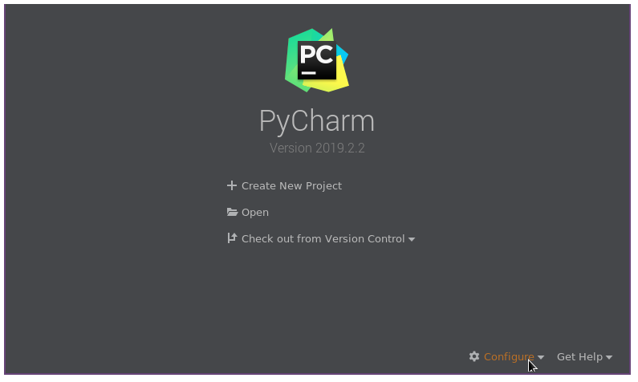

Click on the 'Configure' button on the bottom-right, and select 'Settings'. In the window that pops up, navigate to 'Build, Execution, Deployment' and 'Docker'. Click the '+' button to inform PyCharm of your Docker setup.

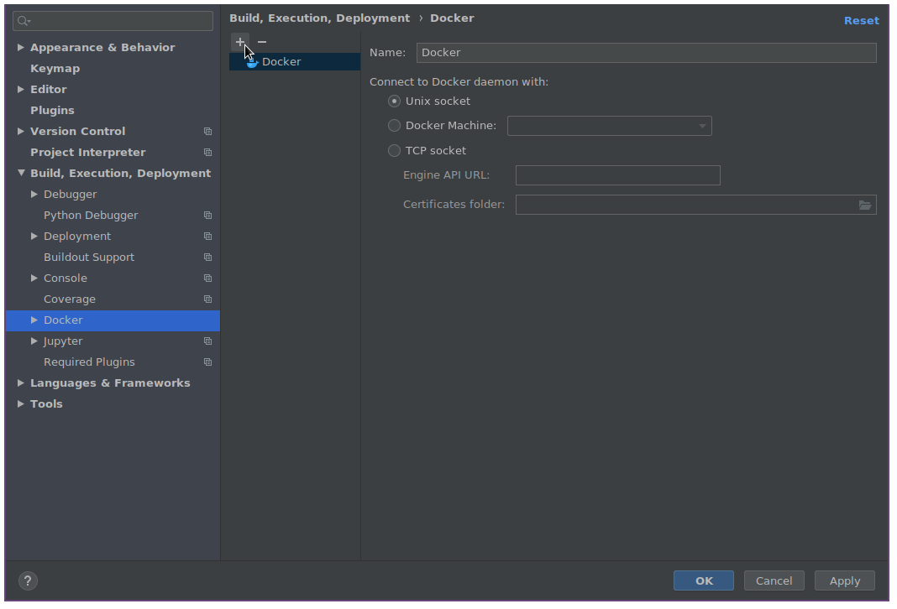

If you are using Linux, select 'Unix socket'. If you are using Mac, select 'Docker for Mac'. If you are using Windows, select 'TCP socket', and enter `tcp://localhost:2375` for the Engine API URL. Click 'OK' to save your changes and exit the settings window.

## Setting Up `cartogram-web` with PyCharm

In the welcome screen, click 'Open'. Alternatively, if you already have a project open in PyCharm, navigate to 'File' and 'Open...' in the menubar. Select the `cartogram-web` folder  and click 'OK'. If prompted, indicate that you want to open the project in a new window.

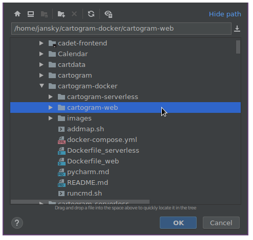

In the project pane on the left, navigate to the `internal` folder, and double click on `web.py` to open it. You will notice that all of the imports are highlighted in red. We are going to configure PyCharm to integrate with our Docker application to fix this. You should notice that an option to select which version of Python to use appears in the bottom-right of the status bar.

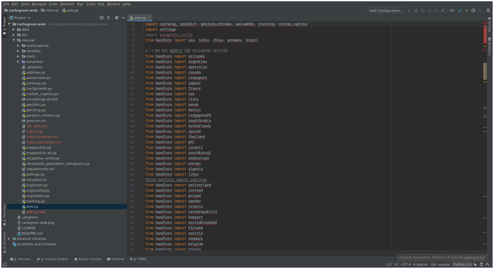

Click on it, and click on 'Add Interpreter...'. In the window that appears, select 'Docker Compose'.

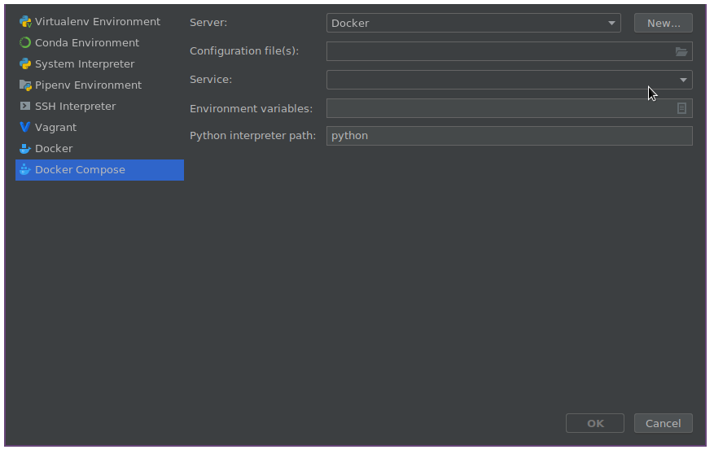

Click the folder icon under 'Configuration file(s)', and click the '+' button. Select the `docker-compose.yml` file in the `cartogram-docker` folder, and click 'OK' twice:

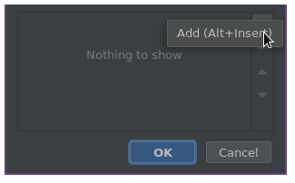

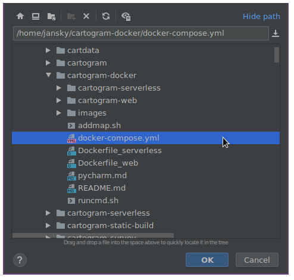

Now, in the 'Add Python Interpreter' window, select the `web` service and click OK.

Now, in the menu bar, navigate to 'File' and 'Settings...'. In the settings window that pops up, navigate to 'Project: cartogram-web' and 'Project Interpreter'. Select the new interpreter we just added (it should have a name like 'Remote Python 3.7.4 Docker Compose **(web...**'). Your settings window should look something like this, including the listed packages:

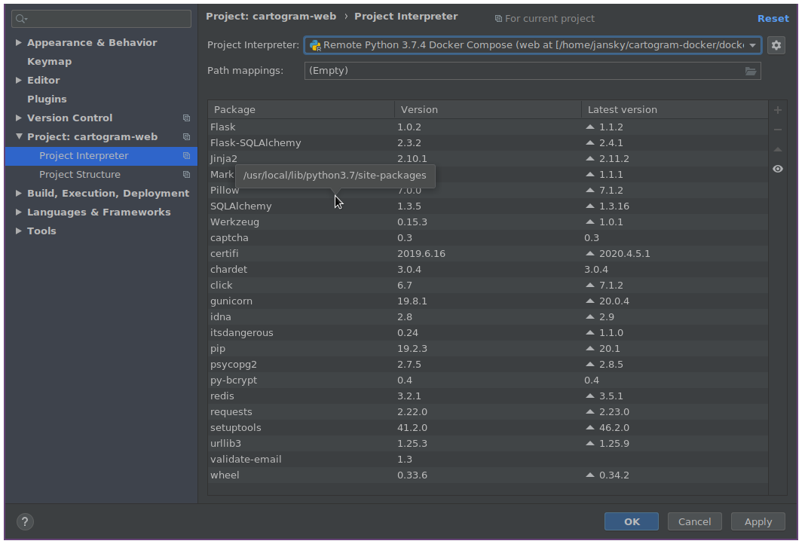

Now navigate to 'Project Structure' on the left. Click on the `internal` folder, and then 'Sources' at the top to mark `internal` as the root of Python source files for the project. Make sure the sub-folder `templates` is also marked as a template folder:

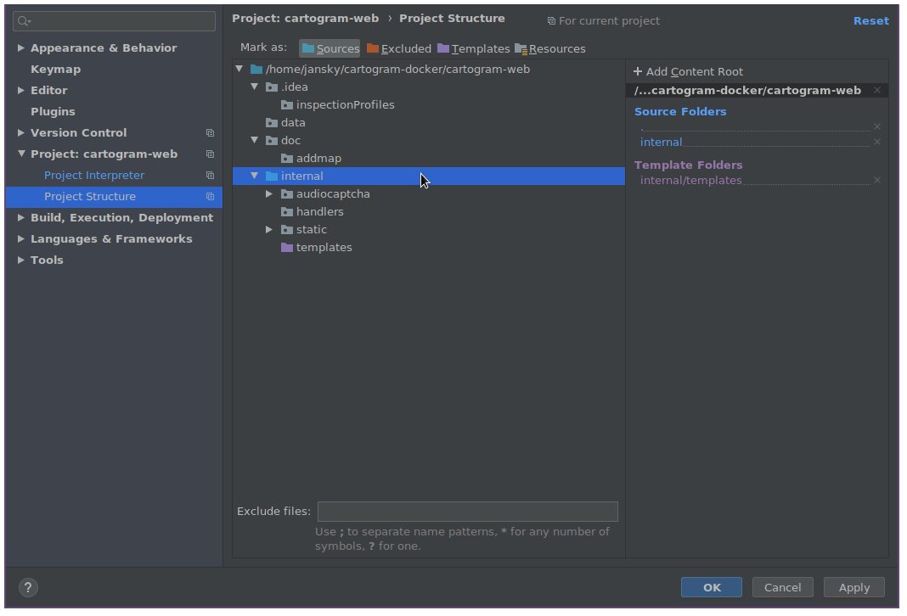

Click 'OK' to exit the settings window. After a moment, you should notice that the import errors in `web.py` have disappeared:

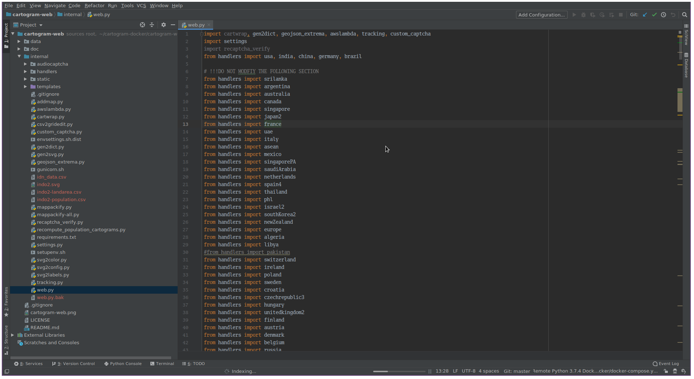

This means you are all done. You can use PyCharm's code completion and code navigation features in the `cartogram-web` project.

## Setting Up `cartogram-serverless` with PyCharm

In the welcome screen, click 'Open'. Alternatively, if you already have a project open in PyCharm, navigate to 'File' and 'Open...' in the menubar. Select the `cartogram-web` folder  and click 'OK'. If prompted, indicate that you want to open the project in a new window:

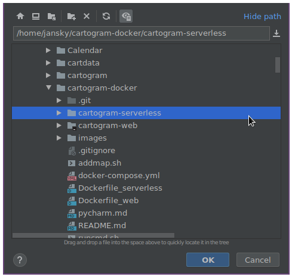

In the project pane on the left, double-click on `simulate_lambda.py` to open it. You will notice that all of the imports are highlighted in red. We are going to configure PyCharm to integrate with our Docker application to fix this. You should notice that an option to select which version of Python to use appears in the bottom-right of the status bar.

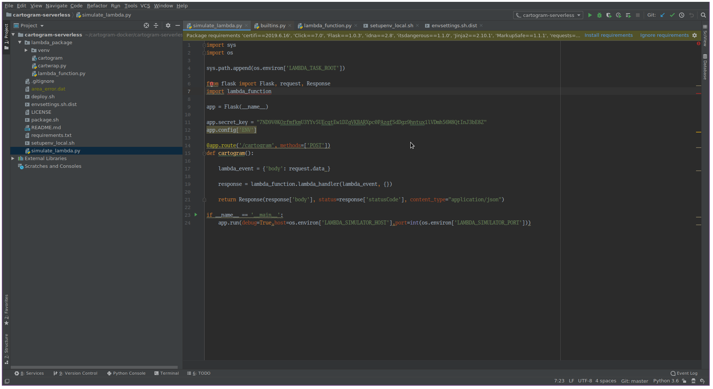

Click on it, and click on 'Add Interpreter...'. In the window that appears, select 'Docker Compose'.


Click the folder icon under 'Configuration file(s)', and click the '+' button. Select the `docker-compose.yml` file in the `cartogram-docker` folder, and click 'OK' twice:


Now, in the 'Add Python Interpreter' window, select the `serverless` service and click OK.

Now, in the menu bar, navigate to 'File' and 'Settings...'. In the settings window that pops up, navigate to 'Project: cartogram-serverless' and 'Project Interpreter'. Select the new interpreter we just added (it should have a name like 'Remote Python 3.7.4 Docker Compose **(serverless...**'). Your settings window should look something like this, including the listed packages:

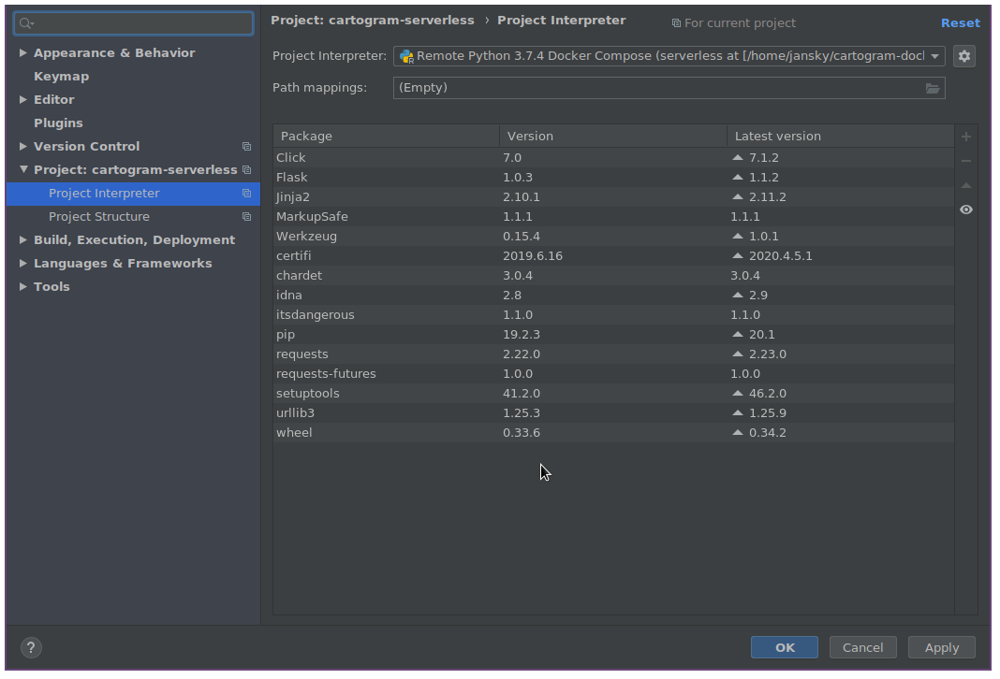

Now navigate to 'Project Structure' on the left. Click on the `lambda_package` folder, and then 'Sources' at the top to mark `lambda_package` as the root of Python source files for the project:

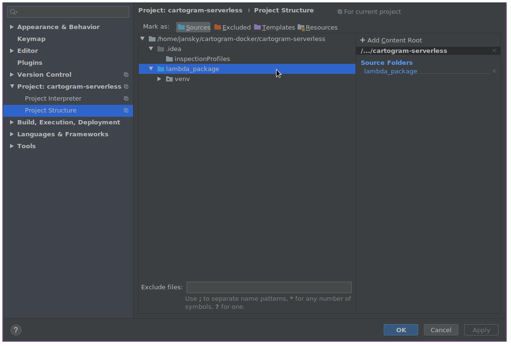

Click 'OK' to exit the settings window. After a moment, you should notice that the import errors in `simulate_lambda.py` have disappeared:

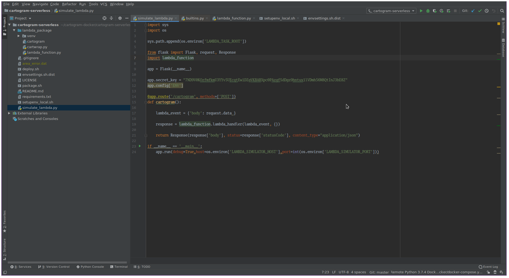

This means you are all done. You can use PyCharm's code completion and code navigation features in the `cartogram-serverless` project.